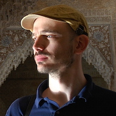



{: .inset .right style="width: 120px"}

# *Using silicon based machines to serve carbon based ones.*

I'm Stathis, welcome to my personal website. 

## About

I'm a physicist and computer scientist by education and a data scientist by profession. 

I like <a href="projects">coding</a> to discover things. Also from time to time I like to write down my thoughts in my <a href="/blog">blog</a>.

I'm also very interested in machine learning and neuroscience. What fascinates me is their intersection especially from an information theoretical and probabilistic inference point of view.

## Around the web

Check my CV at [Linkedin](https://www.linkedin.com/in/stathisfotiadis). 
Follow me on [Twitter](https://twitter.com/sfotiadis_). 
Fork my code on [Github](https://github.com/sfotiadis). 
Read my answers and questions at [Stack Overflow](http://stackoverflow.com/users/1857521/sfotiadis).

## Recent blog posts

<ul class="posts">
  
    <li>{{ post.date | date_to_string }} &raquo; <a href="{{ BASE_PATH }}{{ post.url }}">{{ post.title }}</a></li>
  
</ul>

For more please visit my <a href="/blog">blog</a>.

